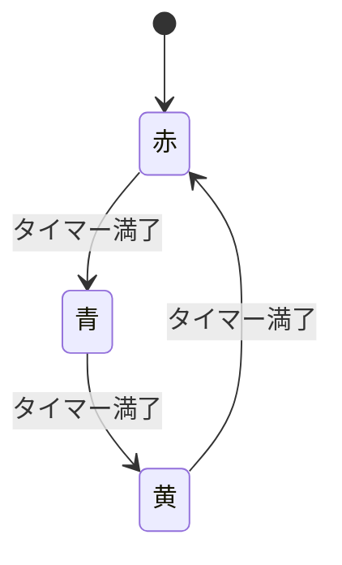

# ステートマシン（状態機械）とは何か：基本概念と要件定義・設計での活用

- 学んだきっかけ: Claudeに「ステートマシンとは何か」を聞いたところから、実務（要件定義・設計フェーズ）でどう役立つかまで掘り下げて教えてもらった。概念そのものより「要件定義の道具としてどう使うか」を後で見返せるよう整理しておく。

## 1. ステートマシンとは何か

- システムが取りうる「状態（state）」を有限個定義し、何らかの「イベント（event）」をきっかけに状態から状態へ「遷移（transition）」していく振る舞いのモデル。プログラミングで使うのは主に「有限状態機械（Finite State Machine, FSM）」で、状態の数が有限個に限定されているのが特徴。
- 基本の構成要素は4つ。
  - **状態（State）**: システムがある瞬間に取っている「モード」。信号機なら「赤・黄・青」。
  - **イベント（Event）**: 状態遷移のきっかけとなる出来事。タイマー満了、ボタン押下、通信成功など。
  - **遷移（Transition）**: 「状態Aでイベントxが起きたら状態Bへ移る」というルール。
  - **アクション（Action）**: 遷移時や状態の出入りのタイミングで実行される処理（ログ出力、変数更新など）。
- 同じイベントでも「今どの状態にいるか」によって結果が変わる、というのが本質。自動販売機なら「商品選択」イベントは、状態が「購入可能」なら商品が出るが「投入金額不足」なら何も起きない。

### 具体例：信号機の状態遷移

## 2. Mealyマシンとムーアマシン（出力の決まり方の違い）

- **ムーアマシン（Moore machine）**: 出力が「現在の状態」だけで決まる。状態に入った瞬間に出力が確定する。
- **メアリマシン（Mealy machine）**: 出力が「現在の状態＋入力」の組み合わせで決まる。同じ状態でも入力次第で異なる出力を返せる。
- 実務でこの区別を厳密に意識しなくても設計はできるが、遷移表を書くときの考え方の違いとして知っておくと役立つ。

## 3. なぜ使うのか（フラグ変数管理との比較）

- `isLoading` / `isError` / `isSuccess` のような複数のbool変数で状態を表現しようとすると、本来ありえないはずの組み合わせ（読み込み中なのにエラーでもある、等）が表現できてしまい、バグの温床になる。
- ステートマシンなら「今この瞬間、システムはこれらの状態のうちどれか1つにしかいない」という前提で設計できるため、ありえない組み合わせをそもそも表現できなくできる。
- 状態と遷移の一覧を図や表にまとめられるので、仕様の抜け漏れ（このイベントが来たときの挙動が未定義、など）に気づきやすい。

## 4. 階層ステートマシン（Statechart）

- 状態の数が増えると単純なFSMの遷移表は管理しづらくなる。
- 階層ステートマシン（UMLのステートマシン図など）は、状態の中にさらに子状態を持たせたり（例:「エラー」状態の中に「タイムアウト」「認証エラー」を持たせる）、複数の状態機械を並行して動かしたりできるようにした拡張版。
- 状態が10種類を超えてくるあたりからは、無理に1枚の図にせず「大分類の状態」と「その中の詳細状態」に分けると整理しやすい。

## 5. 実務での使われ方（応用例）

- UIの画面状態（ローディング中／完了／エラーなど）の切り替え
- ネットワークプロトコル（TCPのコネクション確立・切断の手順など）
- ゲームのキャラクター動作（待機・移動・ジャンプ・攻撃）
- ワークフローエンジン（注文が「受付」→「処理中」→「発送済み」→「完了」と進む業務フロー）
- 正規表現エンジンの内部実装
- フロントエンドでは XState のような専用ライブラリで直接コードとして表現することもある

## 6. 要件定義・設計フェーズでの具体的な役立ち方

### (1) 曖昧な仕様を具体的な問いに変換できる

- 「注文がキャンセルされたらどうなるか」を口頭だけで聞いても業務担当者がその場で答えられないことが多い。
- 先に「注文にはどんな状態がありうるか」（受付済み・支払い待ち・発送準備中・発送済み・キャンセル済み・返品処理中など）を洗い出し、次に「状態×イベント」の表を1マスずつ埋める作業に変換すると、「発送済みの注文はキャンセルできるのか」「支払い待ちでタイムアウトしたらどうなるのか」といった、口頭ヒアリングでは抜けがちな仕様の穴が自然と表面化する。

### (2) ありえない状態の組み合わせを設計段階で排除できる

- 「支払い済みかつキャンセル済み」のようなビジネスルール上ありえない組み合わせが、実装フェーズまで残ってしまうことがある。
- ステートマシンとして定義すると「必ずこの状態一覧のうちどれか1つ」という前提が強制されるため、設計レビューの段階で矛盾を潰せる（実装後にバグとして発覚するより手戻りコストが低い）。

### (3) 関係者間の共通言語・レビューの土台になる

- 状態遷移図はエンジニア以外（企画・QA・顧客）にも見せて議論できる抽象度を持つ。
- 「この状態からこの状態には本当に直接遷移していいのか」「このイベントへの遷移が図にないが意図的か」を、コードを読めない人でも指摘できる。

### (4) テスト設計の基礎になる

- 状態と遷移が明確なら、そこからテストケースを機械的に導出できる。
  - あるべき遷移が正しく起きるかの確認（例: 「支払い待ち」＋「支払い完了イベント」→「発送準備中」）
  - 起きてはいけない遷移が起きないかの確認（例: 「発送済み」＋「キャンセルイベント」→ 何も変わらない）
- 表に沿って網羅的に洗い出せるため、要件定義の段階で「テストすべき組み合わせの一覧」がほぼそのまま出来上がる。

### (5) 非機能要件・例外処理の抜け漏れに気づきやすい

- 「タイムアウトしたら」「通信エラーが起きたら」といった異常系は要件定義で見落とされがち。
- 状態×イベントの表を作ると「このマスが空欄」という形で異常系要件の抜け漏れが視覚的に浮かび上がる。

### (6) システム間・チーム間のインターフェース定義に使える

- 複数サービスが連携する設計で「このサービスはこの状態遷移についてのみ責任を持つ」と責務を切り分ける際にも状態遷移図が使える。
- 例:「注文側のどの状態変化が在庫側にどのイベントとして通知されるか」を状態遷移図で明文化しておくと、API仕様書・イベント設計書のベースになる。

## 7. 使う際の実務上のコツ

1. 要件定義の初期段階では厳密な図を描こうとせず、まず「状態の名前」と「主要なイベント」を業務担当者と洗い出す会話のツールとして使う。
2. 細かい遷移ルールの詰めは、状態の一覧がある程度固まってから「状態×イベントのマトリクス（表）」で埋めると効率的。
3. 状態が10種類を超える場合は、階層ステートマシンの考え方（大分類の状態＋その中の詳細状態）で整理する。

## まとめ

- ステートマシンは「システムがいる状態」「状態を変えるきっかけ（イベント）」「状態が変わったときの遷移ルールと処理」を明確に切り分けて設計する手法。
- 要件定義・設計フェーズでは、①曖昧な仕様を具体的な問いに変換する、②ありえない状態の組み合わせを設計段階で排除する、③関係者間の共通言語になる、④テスト設計の基礎になる、⑤異常系の抜け漏れに気づきやすい、⑥システム間のインターフェース定義に使える、という6つの効果がある。
- 実務では「状態×イベントのマトリクス表」を作る作業そのものが、要件のヒアリング項目・レビュー観点・テストケースを同時に洗い出すツールとして機能する。
